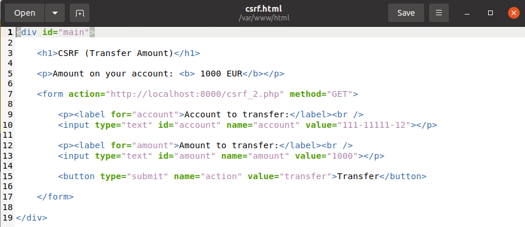
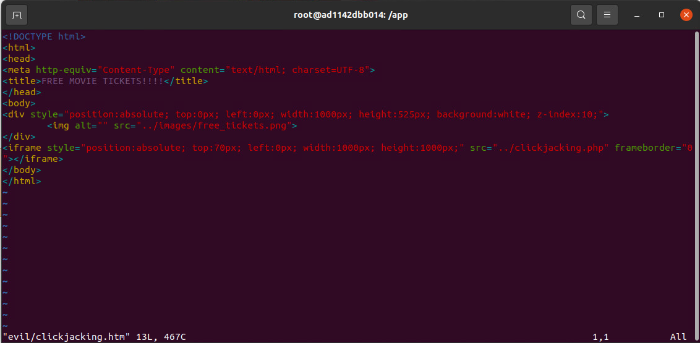

# Reyce Salisbury's BWAPP Vulnerability Writeups (Client Side Vulns)

## Table of Contents:

### Introduction
### A3 - Cross-Site Scripting
 - XSS Stored (Blog)
 - XSS Reflected (GET)
 - XSS Reflected (AJAX/XML)
 - XSS Reflected (phpMyAdmin)
### A8 - Cross-Site Request Forgery
 - CSRF (Transfer Amount)
 - CSRF (Change Password)
### Other bugs
 - ClickJacking (Movie Tickets)

# Introduction

Docker container can be found at https://hub.docker.com/r/raesene/bwapp

BWAPP or 'buggy web application' is a free and open source insecure web application. There are many vulnerabilities within BWAPP, but I will be focusing on the ones listed above.

# A3 - Cross-Site Scripting

## XSS Stored (Blog)

### For this webpage, users can submit messages to add to a 'blog' type object, after submitting, the text is displayed on the page. This can be exploited by maliciously changing the message submitted to be some sort of script for example:

`Fuck Ya Life! `

### since xss_stored_1.php does not check the entered data for scripting/parse out the data, scripts can be run and submissions are stored in the database without any checks or safety measures.

### To demonstrate the capability of a vulnerability such as this, we can up our payload game a little, so to speak.

`.`

### We know this is a stored cross site scripting vulnerability because if we check the database, we can see our previous submissions to the blog

## XSS Reflected (GET)

### This webpage seems to be a sort of welcome function where users are supposed to put their name in and the program tells them 'welcome' User's first and last name are stored in the get parameters for the form submission.

### After manipulating the get parameters in the search bar or in the submission box, we know we can achieve cross-site scripting when we receive an alert after attempting to evoke one with script

`... .php?firstname=&lastname=One-Two-Three&form=submit`

## XSS Reflected (AJAX/XML)

### This webpage updates in real time as you search its movie database. In this instance, each time you type a letter and the script doesn't evaluate to a value, it throws an error with an error message. We can make our payload alert when the search causes an error. After a while, if you type too long, the payload you write will not execute, so you have to copy your payload and paste it shortly after refreshing the page. Using an html encoding website as documentation (sourced below), I encoded what I wanted the output to be (alert(document.cookie)) for the AJAX/XML formatting and created a payload.

`source: https://geeksww.com/tutorials/web_development/javascript/tips_and_tricks/encoding_values_xml_strings_ajax_web2.php`

`&lt;img src=x onerror=alert(document.cookie)&gt;`

# A8 - Cross-Site Request Forgery

## CSRF (Transfer Amount)

### Since we can see the details of the transfer in the url of the webpage, we can copy this url, change the parameters and then host the html of a link with changed parameters somewhere else. After hosting this webpage with maliciously changed parameters, all we have to do is convince a user to click on it, and unknowingly, they will transfer their money somewhere we want instead of somewhere they want.

### original webpage:

### After writing some html with parameters changed on a url, if a user clicks this, they will be taken to a webpage and after pressing the 'transfer' button, the money in their account will be sent to another account. There are other ways to exploit this CSRF vulnerability as well, which I will show with the Change Password page

### After clicking the transfer button on the malicious page:

## CSRF (Change Password)

### This time, we will be exploiting in a slightly different way. Instead of making our own webpage copy, forcing the target user to hit a button in order for our attack to work properly, We will engineer a different type of webpage that will simply send the request for us

### Again, we notice that the parameters for the password changing function are passed as parameters in the url. The same is true for the action. We will be taking advantage of this. To do so, we will create an html file that will lead to a url with a password change of our choosing. In order for this attack to be effective, you'd still need a user to click on the html file, but if they do, the password will be changed to whatever you want it to be.

``

### Upon clicking on this file the target is brought to this page:

### To make certain the exploit worked as intended, we can check that the hash for the 'bee' user's password has changed after clicking on the link to the malicious webpage

# Other bugs

## ClickJacking (Movie Tickets)

### For this vulnerability, there is already a path on the Clickjacking (Movie Tickets) webpage that directs to a link. As of right now, that link goes nowhere, the idea being that an attacker would imitate the Movie tickets page but with some form of clickjacking implemented in the page. This just makes it easy for us to put a webpage up, but we do have to write the html file

### The goal of our little clickjacking adventure will be to coerce a target into clicking the confirm link and buying tickets, even though they think they will be getting free ones (a devious plot, if I do say so myself)
### In order to do so, we will make a webpage that covers information with a picture that says "CLICK HERE FOR FREE MOVIE TICKETS"

### When the user clicks on the confirm link, they find that instead of free movie tickets, they've paid for 10!!!!

